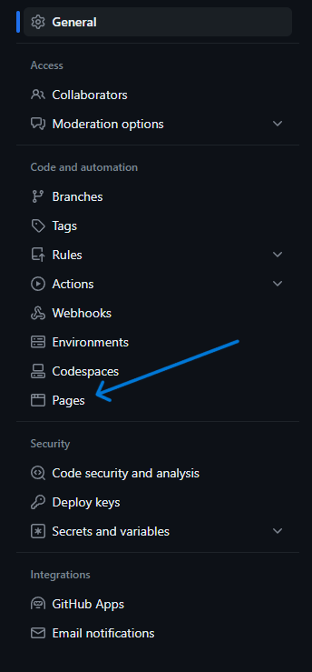
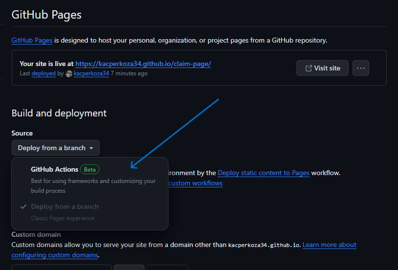
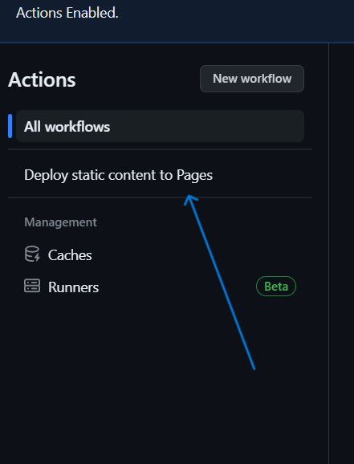
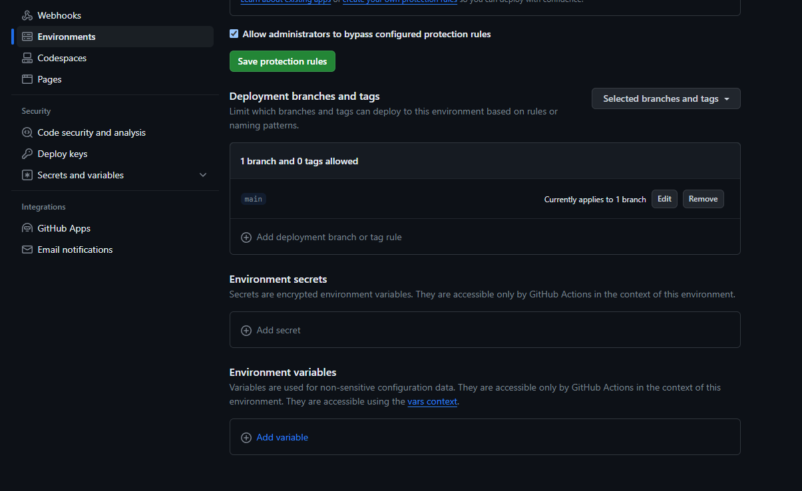

# Hedera Claiming page

## Deployment with github pages

#### 1. Fork repo 
#### 2. On your forked repo go to `Settings` 


#### 3. Go to `Pages`



#### 4. Enable `GitHub Actions`



#### 5. Go to `Actions`


#### 6. Select `Deploy static content to pages`



#### 7. Run workflow with yor details


Alternatively you can set you environment variables in repo setting. Variables set in that way take priority over values provided in `Run workflow` form.



## Run Hedera Claiming page locally

1. Install project dependencies using npm:

   ```bash
   pnpm install
   ```

2. Create a `.env` file in the root directory of the project with the following environment variables:

   ```env
   VITE_HEDERA_NETWORK=testnet
   VITE_HEDERA_SMART_CONTRACT_ID=0.0.12345

   VITE_WALLET_CONFIG_NAME=My app
   VITE_WALLET_CONFIG_DESCRIPTION=My app description
   VITE_WALLET_CONFIG_ICON_URL=https://myappicon.example/
   VITE_WALLET_CONFIG_APP_URL=https://walletconfginurl.example/
   ```

## Available Scripts


Start project in dev mode
   ```bash
   pnpm run dev
   ```

Build project
   ```bash
   pnpm run build
   ```

Serve static files after build
   ```bash
   pnpm run preview
   ```

Run linter
   ```bash
   pnpm run lint
   ```

